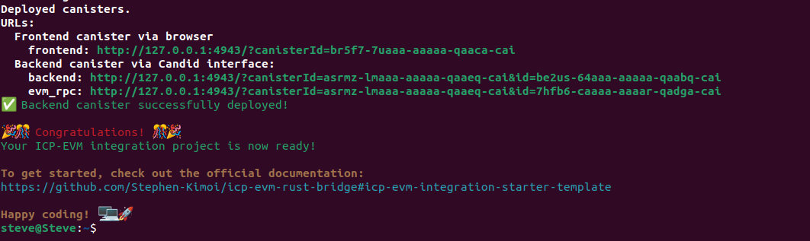
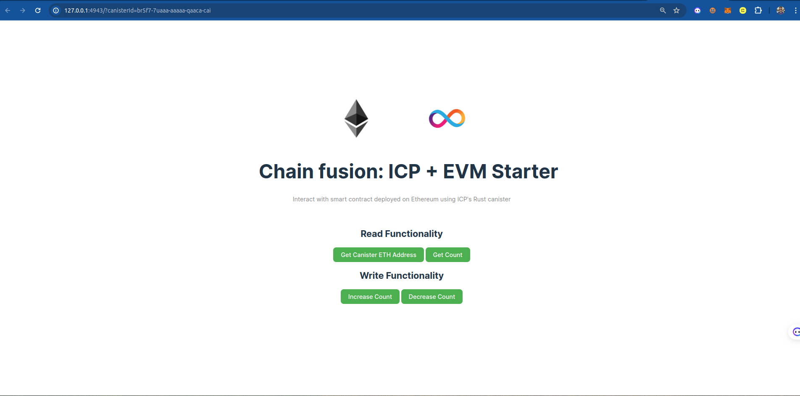

# ICP-EVM Integration Starter Template

This template provides a seamless integration between Internet Computer Protocol (ICP) canisters and Ethereum Virtual Machine (EVM) based smart contracts. It uses Rust for the backend canister and includes a simple Solidity smart contract for demonstration.

It has been built on top of the [evm rpc rust](https://github.com/fxgst/evm-rpc-rust/tree/main) template by [Elias Datler](https://github.com/fxgst)

Link to canister urls: 
1. [Frontend](https://inuxd-qiaaa-aaaal-qjigq-cai.icp0.io/)
2. [Backend](https://a4gq6-oaaaa-aaaab-qaa4q-cai.raw.icp0.io/?id=gr5at-6yaaa-aaaal-qjfiq-cai)
3. [EVM rpc](https://a4gq6-oaaaa-aaaab-qaa4q-cai.raw.icp0.io/?id=7hfb6-caaaa-aaaar-qadga-cai)
## Quick Start

To get started with this template, run the following command:

```bash
bash -c "$(curl -fsSL https://raw.githubusercontent.com/Stephen-Kimoi/icp-evm-rust-bridge/main/install_and_deploy.sh)"
```

This script will:
1. Create a new project
2. Clone this template into the new project
3. Install dependencies
4. Start a local replica
5. Deploy the canister

After running the script, your project will be set up and ready to use!

Once the canister is deployed this is what you'll see: 


You can click on the frontend link and this is what you'll see: 


## Project Structure

```
/
├── backend/
│   └── src/
│       ├── eth_call.rs
│       ├── evm_rpc.rs
│       └── lib.rs
├── smart_contract/
│   └── contracts/
│       └── Counter.sol
└── src/
    └── (frontend files)
```

## Backend (Rust Canister)

### eth_call.rs

This file contains the core functionality for interacting with EVM-based smart contracts.

Key components:
- `call_smart_contract`: A function that handles both read and write operations to the smart contract.
- `sign_transaction`: Handles the signing of transactions for write operations.
- `send_raw_transaction`: Sends the signed transaction to the EVM network.
- Helper functions for conversion between different data formats.

### evm_rpc.rs

This file defines the structures and implementations for interacting with EVM RPC services.

Key components:
- Various structs and enums representing RPC requests and responses.
- `EvmRpcCanister`: An implementation that provides methods for common Ethereum RPC calls.
- `Service`: A struct that wraps the canister ID for making RPC calls.

### lib.rs

This is the main entry point for the canister, containing the public functions that can be called.

Key functions:
- `get_latest_ethereum_block`: Retrieves the latest block from the Ethereum network.
- `get_canister_eth_address`: Derives the Ethereum address for the canister.
- `call_increase_count`: Increases the counter in the smart contract.
- `get_count`: Retrieves the current count from the smart contract.
- `call_decrease_count`: Decreases the counter in the smart contract.

## Smart Contract (Solidity)

### Counter.sol

A simple smart contract that implements a counter with functions to increase, decrease, and get the current count. You can edit and add your smart contract code over here. 

## Usage

### Read Functionalities
Cicking on ``Get Canister ETH Address`` button will generate the Ethereum address of the canister

Clicking on ``Get Count`` will return the count value

### Write functionalities: 
The buttons ``Increase Count`` and ``Decrease Count`` are responsible for performing write functionalities to the smart contract deployed on sepolia

#### Note: The write functions can only work if you've deployed your canister to the mainnet, or you send test eth to the canister via the address that has been generated. The latter method isn't convenient since the address changes regularly for local deployments. 

### Editing your code 
To get started with editing your code, emsure you've changed the ``CONTRACT_ADDRESS`` and ``ABI_JSON`` in the ``lib.rs`` file inside the ``backend/src`` directory

```
// EDIT THESE SECTIONS
const CONTRACT_ADDRESS: &str = "0xAed5d7b083ad30ad6B50f698427aD4907845AAc3";

const ABI_JSON: &str = 
```

### Creating Read Functionalities

To create a read functionality, you can use the following example as a template:

```rust
#[ic_cdk::update]
async fn get_count() -> Result<u64, String> {
    let abi = get_abi();
    
    let result = call_smart_contract(
        CONTRACT_ADDRESS.to_string(), 
        &abi, 
        "getCount", 
        &[], 
        false, // This is a read operation
        None, None, None, None, None, None, None // These parameters are not needed for read operations
    ).await?;

    let count_value = result
        .get(0)
        .ok_or("Expected a single value in the return value")?
        .clone()
        .into_uint()
        .ok_or("Expected a uint256 value")?;

    Ok(count_value.low_u64())
}
```

This function works as follows:

1. It uses `get_abi()` to retrieve the ABI of the smart contract.
2. It calls `call_smart_contract` with the following parameters:
   - `CONTRACT_ADDRESS`: The address of the deployed smart contract.
   - `&abi`: The ABI of the contract.
   - `"getCount"`: The name of the function to call in the smart contract.
   - `&[]`: An empty array for function arguments (if any were needed).
   - `false`: Indicates this is a read operation.
   - `None` values: These are not needed for read operations.
3. The result is then processed to extract the returned value.

The `call_smart_contract` function from the `eth_call` module handles the interaction with the Ethereum network, including encoding the function call and decoding the result.

### Creating Write Functionalities

For write operations, you can use the following example:

```rust
#[ic_cdk::update]
async fn call_increase_count() -> Result<String, String> {
    let abi = get_abi();
    let canister_address = get_canister_eth_address().await;
    let nonce = get_nonce(&canister_address).await?;

    let result = call_smart_contract(
        CONTRACT_ADDRESS.to_string(),
        &abi,
        "increaseCount",
        &[],
        true, // This is a write operation
        Some(U64::from(11155111)), // Sepolia chain ID
        Some(CONTRACT_ADDRESS.to_string()),
        Some(U256::from(500000)), // Gas limit
        Some(U256::from(0)), // Value (0 ETH)
        Some(nonce),
        Some(U256::from(3_000_000_000u64)), // Max priority fee
        Some(U256::from(40_000_000_000u64)), // Max fee
    )
    .await;

    match result {
        Ok(tx_hash) => Ok(format!("Increased count. Transaction hash: {:?}", tx_hash)),
        Err(e) => Err(format!("Failed to send transaction: {:?}", e))
    }
}
```

This function works as follows:

1. It retrieves the ABI and the canister's Ethereum address.
2. It gets the current nonce for the canister's address.
3. It calls `call_smart_contract` with parameters for a write operation:
   - `true` indicates it's a write operation.
   - It includes chain ID, gas limit, nonce, and gas pricing information.
4. The function returns the transaction hash on success or an error message on failure.

The `call_smart_contract` function handles the complexities of creating, signing, and sending the transaction to the Ethereum network.

### Important Notes

- Ensure you've updated the `CONTRACT_ADDRESS` and `ABI_JSON` in the `lib.rs` file to match your deployed smart contract.
- Write operations require the canister to have ETH for gas fees. For local deployments, you may need to send test ETH to the canister's address.
- The canister's Ethereum address may change in local deployments, so be aware of this when testing write functionalities.

